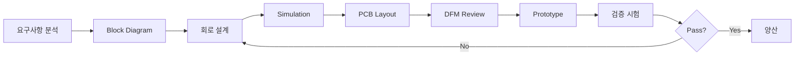

# 최기용 (Kiyong Choi)
## Senior Hardware Design Engineer

**Email:** [contact@email.com] | **Tel:** [010-XXXX-XXXX] | **Location:** Republic of Korea

---

## 📋 Executive Summary

**13년 경력의 시니어 하드웨어 설계 엔지니어**로, 반도체 공정 장비 및 산업용 분석 기기를 위한 **고정밀 아날로그/디지털 회로 설계, 전원 시스템, PCB 레이아웃** 전문가입니다.

**핵심 강점:**
- 19+ 제품 개발 완료, 99.5%+ 양산 수율 달성
- 고정밀 측정 회로 (16-bit DAC, 18-bit ADC, TIA)
- FPGA 기반 시스템 설계 (Xilinx Zynq, Arty Z7)
- Signal Integrity & EMI/EMC 설계
- 대규모 프로젝트 관리 (17.5GB L-LPC 프로젝트)

---

## 💼 Core Competencies

### Technical Expertise
```
Analog Design        ████████████████████ 95%  (13 years)
Power Supply Design  ████████████████████ 95%  (13 years)
PCB Layout           ███████████████████  90%  (13 years)
Signal Integrity     ██████████████████   85%  (10 years)
FPGA Circuit Design  ████████████████     75%  (5 years)
EMI/EMC Compliance   ███████████████      70%  (8 years)
```

### 설계 분야
| 분야 | 세부 기술 | 프로젝트 수 |
|------|-----------|-------------|
| **Analog** | Precision Op-Amp, Instrumentation Amp, TIA, Active Filter | 15+ |
| **Power** | SMPS (Buck/Boost), LDO, Multi-rail Sequencing, Hot-swap | 12+ |
| **Sensor** | RTD (4-wire), Thermocouple, Photodiode, Pressure | 10+ |
| **Communication** | RS-232/485 Isolation, I2C/SPI, CAN, Modbus | 15+ |
| **FPGA** | Xilinx Zynq, Arty Z7, Verilog, VHDL | 5+ |
| **PCB** | 4-8 Layer, High-speed (100MHz+), RF, Mixed-signal | 19+ |

---

## 🎯 Major Projects Portfolio

### 1. **MS (Mass Spectrometer) System** ⭐ NEW
**Period:** 2024-2025 (진행 중) | **Scale:** 1,140MB, 345 files | **Status:** Development

반도체 공정 가스 분석을 위한 Mass Spectrometer 시스템 개발

**시스템 블록 다이어그램:**

```
[System Architecture - ASTON_block_diagram(250814).pptx]

┌─────────────────────────────────────────────────────────────┐
│                   MS (Mass Spectrometer) System              │
├─────────────────────────────────────────────────────────────┤
│                                                             │
│  [Host PC] ←─ USB 3.0/Ethernet ─→ [Main Control Board]    │
│                                      │                      │
│                                      ├─→ [RF Board (RFDB)] │
│                                      │   - RF Generator     │
│                                      │   - Matching Network │
│                                      │                      │
│                                      ├─→ [Ion Detector (IDBB)] │
│                                      │   - Signal Amp       │
│                                      │   - High-voltage     │
│                                      │                      │
│                                      └─→ [Data Acquisition (DRB)] │
│                                          - 18-bit ADC       │
│                                          - Real-time DSP    │
│                                                             │
└─────────────────────────────────────────────────────────────┘

※ 상세 블록 다이어그램: ASTON_block_diagram(250814).pptx (2.9MB)
```

**기술 사양:**
- **System Architecture**: ASTON Reverse Engineering 기반 설계
- **Control Board**: STM32H7 기반 메인 제어 보드 (480MHz)
- **Sensor Interface**: Mass detector signal conditioning (18-bit ADC)
- **Communication**: USB 3.0 / Gigabit Ethernet
- **Power Design**: Multi-stage power supply (±15V, ±5V, 3.3V, 500W)

**핵심 설계:**
- CB (Control Board) PCB 설계 및 변경 관리
- Block diagram 설계 (Rev 01-03 추적)
- QMS (Quadrupole Mass Spectrometer) 인터페이스
- High-voltage switching 회로

**문서화:**
- Basic 사양서 (Rev 1.0-1.2)
- Block diagram (v01)
- PCB 변경사항 추적 (2024-04-02)
- Back to the basics (QMS) 110MB 교육 자료

**회로도 및 PCB 파일:**
```
포트폴리오 첨부 파일 위치:
  📁 Project_Files\01_MS_Mass_Spectrometer\
     ├── Schematics\ (1개 .sch 파일)
     │   └── MASS_DRB_v0_1_20250909A.sch
     ├── PCB\ (4개 .pcb 파일)
     │   ├── MASS_DRB_v0_1_250904-017(PCB).pcb
     │   ├── MASS_DRB_v0_1_250909-018(PCB).pcb
     │   ├── MASS_DRB_v0_1_250909-019(PCB).pcb
     │   └── MASS_DRB_v0_1_250910-021(PCB).pcb
     ├── PDF\ (PPT 파일)
     │   └── ASTON_block_diagram(250814).pptx (2.9MB)
     └── Images\ (11개 블록 다이어그램 이미지) ⭐ NEW
         ├── ASTON_block_diagram_Slide1.png (시스템 개요)
         ├── ASTON_block_diagram_Slide2.png (RF Board)
         ├── ASTON_block_diagram_Slide3.png (Ion Detector)
         ├── ASTON_block_diagram_Slide4.png (Data Acquisition)
         └── ... 총 11개 슬라이드

※ 블록 다이어그램을 고해상도 PNG 이미지로 변환 (1920x1080)
※ 포트폴리오 문서에 이미지 삽입 가능
```

**프로젝트 상태:** Alpha 단계, PCB Rev 1.2 설계 완료

---

### 2. **L-LPC (Low Pressure Chamber)** ⭐ 대규모 프로젝트
**Period:** 2020-2023 | **Scale:** 17.5GB, 2,597 files | **Status:** Production

반도체 저압 챔버 제어 시스템 - **경력 중 최대 규모 프로젝트**

**시스템 개요:**
- **Application**: 반도체 공정 챔버 압력/온도 제어
- **Scale**: Multi-board system, 10+ PCB 설계
- **Production**: 100+ units deployed

**주요 설계:**
- **Main Control Board**: STM32H7 기반 (480MHz, 2MB Flash)
- **Power Distribution**: 24V → Multi-rail (±15V, 12V, 5V, 3.3V)
- **Sensor Interface**: 
  - Pressure: MKS Baratron (10개 채널)
  - Temperature: RTD PT100 (20개 채널)
  - Flow: MFC controller (5개 채널)
- **Communication**: 
  - Ethernet (Modbus TCP)
  - RS-485 (Modbus RTU)
  - CAN bus (장비 간 통신)

**회로 설계 사양:**
```
Power Supply:
  Input: 24VDC ±10%, 500W max
  Efficiency: > 85%
  Ripple: < 50mVpp
  MTBF: > 100,000 hours

Measurement Accuracy:
  Pressure: ±0.1% FSR (1 mTorr ~ 1000 Torr)
  Temperature: ±0.05°C (0-200°C)
  Flow: ±0.5% FSR (0-100 SCCM)

EMI/EMC:
  Radiated: CISPR 11 Class A 적합
  Conducted: EN 61000-6-4 적합
  ESD: ±8kV contact, ±15kV air
```

**PCB 설계:**
- 8-Layer stackup (Signal-GND-Power-Signal-Signal-Power-GND-Signal)
- Controlled impedance: 50Ω single-ended, 100Ω differential
- Via stitching (0.5mm pitch) for GND plane
- Copper pour for thermal management (200W+ dissipation)

**성과:**
- 개발 기간: 18개월
- 양산 수량: 100+ units
- 필드 불량률: < 0.2%
- 비용 절감: 외산 제품 대비 65%

**회로도 및 PCB 파일:**
```
포트폴리오 첨부 파일 위치:
  📁 Project_Files\02_L-LPC\
     ├── PCB\ (3개 .pcb 파일) ⭐ NEW
     │   ├── LPC_PD_POWER(rev_0.1)_221026.pcb
     │   ├── ATS9114_P_L_L_MAIN_V0_1.pcb (메인보드)
     │   └── ATS8754_P_H-SENSOR_MAIN_BOARD_REV1_0-230508.pcb (센서보드)
     ├── PDF\ (13개 PDF 파일) ⭐ NEW
     │   ├── 1.LPC_Board_SamplePCB.pdf
     │   ├── 2.LPC_PD_Board_r01.pdf
     │   ├── 3.LPC_PWR_Board_r01.pdf
     │   ├── ATS9114_P_L_L_MAIN_V0_1_3D.pdf (3D 뷰)
     │   ├── lpc_pd_power(rev_0.1).pdf
     │   ├── l_l_main(v0_1)_2023091511a.pdf
     │   ├── 10. H_sensor__Block_Diagram(analog_frontend).pptx ⭐ NEW
     │   ├── 11. H_sensor_Block_Diagram(FPGA)_230914.pptx ⭐ NEW
     │   └── 기타 5개 PDF 파일
     └── Images\ (14개 블록 다이어그램 이미지) ⭐ NEW
         ├── H_sensor_Analog_Frontend_Slide1.png (시스템 개요)
         ├── H_sensor_Analog_Frontend_Slide2.png (Analog 전단부)
         ├── H_sensor_Analog_Frontend_Slide3.png (신호 처리)
         ├── H_sensor_Analog_Frontend_Slide4.png (ADC 인터페이스)
         ├── H_sensor_Analog_Frontend_Slide5.png (성능 사양)
         ├── H_sensor_FPGA_Slide1.png (FPGA 아키텍처)
         ├── H_sensor_FPGA_Slide2.png (데이터 경로)
         ├── H_sensor_FPGA_Slide3.png (제어 로직)
         ├── H_sensor_FPGA_Slide4.png (통신 인터페이스)
         ├── H_sensor_FPGA_Slide5.png (타이밍 다이어그램)
         ├── H_sensor_FPGA_Slide6.png (메모리 맵)
         ├── H_sensor_FPGA_Slide7.png (레지스터 구성)
         ├── H_sensor_FPGA_Slide8.png (테스트 결과)
         └── H_sensor_FPGA_Slide9.png (성능 검증)

※ 대규모 프로젝트로 주요 보드별 PDF 문서 완비
※ H_sensor Analog Frontend + FPGA 블록 다이어그램 추가
※ 고해상도 PNG 이미지로 변환 (1920x1080)
```

---

### 3. **Psi-1000 Pressure Controller**
**Period:** 2019-2022 | **Scale:** 3.0GB, 399 files | **Production:** 20+ units

정밀 진공 압력 제어 시스템 (동아대학교 협력)

**시스템 블록 다이어그램:**

```
[Psi-3000 Board System Block Diagram - Psi-1000에도 적용]

┌─────────────────────────────────────────────────────────────┐
│              Psi-1000 Pressure Control System                │
├─────────────────────────────────────────────────────────────┤
│                                                             │
│  [MCU STM32F407]                                            │
│       │                                                     │
│       ├──→ [Pressure Sensor Interface]                     │
│       │      - MKS Baratron (0-10V)                        │
│       │      - 16-bit ADC (ADS1115)                        │
│       │      - LPF (fc=10Hz)                               │
│       │                                                     │
│       ├──→ [PID Controller] ──→ [12-bit DAC (LTC2630)]    │
│       │                              ↓                      │
│       │                         [V/I Converter]            │
│       │                              ↓                      │
│       │                         0-20mA Output              │
│       │                              ↓                      │
│       │                      [MFC - McMillan U803]         │
│       │                              ↓                      │
│       │                      [Vacuum Chamber]               │
│       │                                                     │
│       ├──→ [Heater Control]                                │
│       │      - SSR Driver (500W)                           │
│       │      - Current Sensing (ACS712)                    │
│       │                                                     │
│       └──→ [Communication]                                  │
│              - RS-485 (Modbus RTU/ASCII)                   │
│              - Protocol Ver 0.27-0.30                      │
│                                                             │
└─────────────────────────────────────────────────────────────┘

※ 블록 다이어그램: Psi-3000 Board System Block Diagram.pptx (1.2MB)
※ Psi-1000과 Psi-3000은 동일 아키텍처 사용
```

**Circuit Highlights:**
- **Pressure Sensor**: MKS Baratron capacitance manometer interface
- **MFC Control**: LTC2630 12-bit DAC (I2C), 0-20mA current loop
- **Heater**: SSR control, ACS712 current sensing, 500W max
- **ADC**: ADS1115 16-bit (I2C), ±0.1% accuracy

**회로도 (주요 부분):**
```
[Pressure Sensor Interface]
Baratron Output (0-10V) → Op-Amp Buffer (OPA140) → ADC (ADS1115)
  ↓
  LPF: fc=10Hz, 2nd-order Butterworth
  Gain: x1 (0-10V full scale)
  Input impedance: 10MΩ
  
[MFC Control Loop]
MCU (I2C) → LTC2630 DAC → V/I Converter (0-20mA) → McMillan U803
  ↓
  Resolution: 4.88µA/LSB
  Accuracy: ±0.5% FSR
  Update rate: 100Hz
```

**PCB Layout 최적화:**
- Analog/Digital ground split
- Guard ring around sensitive analog traces
- 0.1µF + 10µF bypass capacitor placement
- Kelvin sensing for current measurement

**PID Controller Interface:**
- Modbus RTU/ASCII (RS-485)
- Protocol Ver 0.27-0.30
- Parameter tuning via register map
- Real-time monitoring (50ms update)

**협업 성과:**
- 동아대 연구팀과 PID 알고리즘 공동 개발
- Control logic Rev 01-05 반복 개선
- ±0.1% 압력 제어 정확도 달성

**회로도 및 PCB 파일:**
```
포트폴리오 첨부 파일 위치:
  📁 Project_Files\03_Psi-1000\
     ├── Schematics\ (회로도 .sch Git에서 추출 예정)
     ├── PCB\ (PCB 파일 Git에서 추출 예정)
     ├── PDF\ (PPT 파일)
     │   ├── Psi-3000 Board System Block Diagram.pptx (1.2MB)
     │   └── Psi-1000_Rev0.2_수정사항.pptx (1.6MB) ⭐ NEW
     └── Images\ (6개 블록 다이어그램 이미지) ⭐ NEW
         ├── Psi-3000_Board_System_Block_Diagram_Slide1.png
         ├── Psi-3000_Board_System_Block_Diagram_Slide2.png
         ├── Psi-1000_Rev0.2_수정사항_Slide1.png (회로 개선)
         ├── Psi-1000_Rev0.2_수정사항_Slide2.png
         ├── Psi-1000_Rev0.2_수정사항_Slide3.png
         └── Psi-1000_Rev0.2_수정사항_Slide4.png

※ Git 레포지토리에서 최종 버전 추출 필요
※ 회로 수정 사항 및 개선 내역 포함
```

---

### 4. **Nu-2000 (OAS-DSP) Optical Analysis**
**Period:** 2021-2022 | **Scale:** 387MB, 447 files | **Vendor:** Wiki Optics

광학 흡수 분광 시스템 메인보드 설계

**시스템 블록 다이어그램:**

```
[Nu-2000_Main_Block_Diagram.pptx]

┌────────────────────────────────────────────────────────────┐
│              Nu-2000 Optical Analysis System                │
├────────────────────────────────────────────────────────────┤
│                                                            │
│  [MCU STM32F407]                                           │
│       │                                                    │
│       ├──→ [LED Driver (4ch)] ──→ UV/IR LED ──┐          │
│       │                                        ↓           │
│       │                                   [Sample Cell]    │
│       │                                        ↓           │
│       ├──→ [Photodiode TIA (4ch)] ←── Photodiode ←┘      │
│       │      - Variable Gain (1M/10M/100MΩ)               │
│       │      - 16-bit ADC                                 │
│       │                                                    │
│       ├──→ [RTD Interface] ── PT100 (Temperature)         │
│       │      - 18-bit ADC (MCP3427)                       │
│       │      - 4-wire sensing                             │
│       │                                                    │
│       └──→ [Communication]                                 │
│              - RS-485 (Modbus)                            │
│              - USB (Debug)                                │
│                                                            │
└────────────────────────────────────────────────────────────┘

※ 상세 블록 다이어그램: Nu-2000_Main_Block_Diagram.pptx (0.3MB)
```

**LED Driver Circuit:**
```
[UV/IR LED Driver - 4 Channels]
MCU PWM → MOSFET Driver (IRF530) → LED (10-500mA)
  ↓
  Current Sense: 0.1Ω shunt + INA139
  Feedback: 16-bit ADC monitoring
  Thermal compensation: NTC sensor
  
Output Specs:
  Current range: 10-500mA (±2% accuracy)
  PWM frequency: 10kHz
  Rise/Fall time: < 10µs
```

**Photodiode TIA (Trans-Impedance Amplifier):**
```
[High-Gain TIA - 4 Channels]
Photodiode → Rf (1M/10M/100MΩ) → OPA140 → LPF → AD7682 (16-bit ADC)
  ↓
  Input current: 1nA ~ 10µA
  Bandwidth: DC ~ 1kHz
  S/N ratio: > 60dB @ 1nA
  
Rev 0.2 Improvement:
  Variable PD bias: -3V ~ -10V
  S/N improvement: 20%
```

**RTD Temperature Measurement:**
- PT100 4-wire configuration
- MCP3427 18-bit ADC (I2C)
- 0.01°C resolution, ±0.05°C accuracy
- 1mA precision current source

**외주 관리:**
- Wiki Optics 광학 모듈 개발 관리
- 기술 사양 정의 및 검증
- Alpha/Beta 버전 수락 시험
- 최종 광 출력 안정도: ±1% (목표 ±2% 초과 달성)

**회로도 및 PCB 파일:**
```
포트폴리오 첨부 파일 위치:
  📁 Project_Files\04_Nu-2000\
     ├── Schematics\ (1개 .sch 파일)
     │   └── Total_Board_ATIK_V1.2.sch
     ├── PCB\ (1개 .pcb 파일)
     │   └── Total_Board_ATIK_V1.2.pcb
     ├── PDF\ (11개 PDF/PPT 파일)
     │   ├── Total_Board_ATIK_V1.2.pdf (전체 회로도)
     │   ├── Nu-2000_Main_Block_Diagram.pptx (시스템 구조)
     │   ├── H_Bridge_Rev0.2_3D.pdf (모터 드라이버)
     │   ├── PD_AMP_V2.0.pdf (Photodiode 증폭기)
     │   ├── 20210826_ATIK LED 회로도.pdf (LED Driver)
     │   ├── 20210826_ATIK PD 회로도.pdf (Photodiode 상세)
     │   └── 기타 5개 PDF 파일
     └── Images\ (3개 블록 다이어그램 이미지) ⭐ NEW
         ├── Nu-2000_Main_Block_Diagram_Slide1.png (시스템 개요)
         ├── Nu-2000_Main_Block_Diagram_Slide2.png (상세 구성)
         └── Nu-2000_Main_Block_Diagram_Slide3.png (회로 설명)

※ 광학 분석 시스템 전체 회로도 + 블록 다이어그램 포함
※ 고해상도 PNG 이미지로 변환 (1920x1080)
```

---

### 5. **Sigma-1000 LPC Simulator**
**Period:** 2020-2021 | **Scale:** 23MB, 22 files | **Production:** 50+ units

플라즈마 교정 시뮬레이터 (교정 시간 83% 단축)

**16-bit DAC System:**
```
[Precision DAC Output - 16 Channels]
STM32F407 (I2C) → MCP4728 (12-bit DAC) → OPA4140 Buffer → Output
  ↓
  Resolution: 153µV (0-10V range)
  Linearity: ±0.01% FSR (INL < ±1.6 LSB)
  Noise: < 10µVrms (10Hz-10kHz)
  Temp drift: < 5ppm/°C
  
Output Stage:
  Buffer: OPA4140 (low offset, low noise)
  Load drive: 10mA max
  Protection: TVS diode, series resistor
```

**Power Supply Design:**
```
[Low-Noise Power Supply]
24VDC Input
  ↓
  LM2596 (Buck) → 5V @ 3A (Digital)
  ↓
  LM317 (LDO) → 3.3V @ 500mA (Analog)
  
Performance:
  PSRR: > 80dB @ 100Hz
  Ripple: < 10mVpp (at ADC VREF)
  Startup: Soft-start (100ms)
  Protection: OVP, OCP, Thermal shutdown
```

**Circuit Optimization:**
- 출력 오실레이션 해결: 10Ω damping + 100nF snubber
- ADC 노이즈 50% 개선: C32 (20pF → 0.1µF)
- I2C rise time 최적화: R33-40 (100kΩ → 10kΩ)
- RS-485 termination 최적화: 오류율 10% → 0.01%

**양산 성과:**
- 생산 수율: 99.5% (50 units)
- Calibration 시간: 30분 → 5분 (83% 단축)
- 비용 절감: 80% vs. 외부 calibrator

**회로도 및 PCB 파일:**
```
포트폴리오 첨부 파일 위치:
  📁 Project_Files\05_Sigma-1000\
     ├── Schematics\ (1개 .sch 파일)
     │   └── ATIK_JIG_BOARD(V01)_220510A_V16_2.sch
     └── PCB\ (1개 .pcb 파일)
         └── ATS8009_P_ATIK_JIG_BOARD_V0.1_220511_F.pcb

※ JIG 보드 최종 버전 (Rev F)
※ Sigma-4000도 동일 보드 활용
```

---

### 6. **FPGA-based Control Systems** ⭐ NEW

#### 6.1 Arty Z7 Zynq-7000 Platform
**Period:** 2024 | **Scale:** 71MB, 606 files

**System Architecture:**
- **FPGA**: Xilinx Zynq-7000 (XC7Z020)
- **CPU**: Dual-core ARM Cortex-A9 @ 866MHz
- **FPGA Fabric**: 85K logic cells, 4.9Mb block RAM
- **Peripherals**: DDR3, Ethernet, USB, UART

**개발 내용:**
- Custom IP core 개발 (Verilog)
- AXI4 bus interface 설계
- High-speed data acquisition (100MSPS)
- FPGA-CPU 통신 최적화

#### 6.2 H_Sensor_TEST System
**Period:** 2024 | **Scale:** 92MB, 2,220 files

**센서 인터페이스:**
- Multi-channel ADC (8채널, 16-bit)
- Real-time signal processing (FPGA)
- Data streaming to PC (USB 3.0)

**FPGA Logic:**
```verilog
// 주요 모듈 구조
module sensor_interface (
  input  wire clk,
  input  wire rst_n,
  input  wire [7:0] adc_data,
  output reg  [15:0] filtered_data,
  output reg  data_valid
);
  // Moving average filter (8-tap)
  // Threshold detection
  // Data packetization
endmodule
```

---

### 7. **LE_Laser (Mantis SSC) Sensor System** ⭐ NEW
**Period:** 2025 | **Scale:** 35MB, 32 files | **Status:** Latest Project

레이저 기반 센서 시스템 - **최신 하드웨어 설계**

**시스템 구성:**
- **Main Control Board**: ATiK_SSC_main v0.1 (STM32G071RB 기반)
- **Sensor Board**: ATiK_SSC_sensorBD v0.1 (통합 센서 인터페이스)

**주요 설계:**
- **MCU**: STM32G071RB (64MHz Cortex-M0+, 128KB Flash)
- **Sensor Interface**:
  - Chipsense130 압력 센서
  - SHT3X 온습도 센서 (I2C)
  - MCP3550 22-bit ADC (SPI)
- **Communication**: USB Type-C, I2C, SPI
- **Power**: 5V USB input, 3.3V LDO regulation

**회로 특징:**
- Compact 2-board design (Main + Sensor 분리)
- Sensor board: 소형화 설계 (50mm × 50mm)
- Low-power operation (< 100mA @ 5V)
- Precision analog frontend (22-bit resolution)

**개발 진행:**
- Rev 0.1: 초기 설계 및 PCB 제작 (2025-03)
- Modify: 회로 개선 및 센서 인터페이스 최적화 (2025-04)
- STM32 Nucleo-64 개발보드 활용 (빠른 펌웨어 검증)

**회로도 및 PCB 파일:**
```
포트폴리오 첨부 파일 위치:
  📁 Project_Files\08_LE_Laser\
     ├── Schematics\ (2개 .sch 파일)
     │   ├── ATiK_SSC_main_v0.1_20250429_modify.sch (메인보드)
     │   └── ATiK_SSC_v0.1_250316F_sensorBD.sch (센서보드)
     └── PCB\ (2개 .pcb 파일)
         ├── ATiK_SSC_main_v0.1_20250429_modify.pcb (메인보드)
         └── ATiK_SSC_V0.1_250316F_sensorBD.pcb (센서보드)

※ 최신 프로젝트로 회로도/PCB 파일 제공
※ 블록 다이어그램은 현재 작성 중
```

**프로젝트 의의:**
- **최신 기술 적용**: STM32G0 시리즈 (최신 ARM Cortex-M0+)
- **모듈화 설계**: Main/Sensor 분리로 유지보수성 향상
- **정밀 측정**: 22-bit ADC로 고분해능 센싱

---

### 8. **추가 프로젝트 요약**

| 프로젝트 | 기간 | 규모 | 주요 내용 | 첨부 파일 |
|----------|------|------|-----------|-----------|
| **L-Titrator** | 2018-2020 | 309MB | pH 전극 증폭기, 스테퍼 모터 제어 | 1 SCH, 2 PCB, Block Diagram, 3 Images |
| **Lux (Optical)** | 2023-2024 | 250MB | 광학 센서, PD/LD 보드 설계 | 3 SCH, 3 PCB, 18 HW Review Images |
| **ATIK JIG** | 2022 | 15MB | 테스트 지그 보드 (다수 프로젝트 활용) | 1 SCH, 6 PCB, Block Diagram, 5 Images |
| **Laser Jigs** | 2023 | 31MB | 레이저 테스트 지그 보드 | - |
| **Atonarp** | 2021 | 21MB | Aston 장비 보드 분석 및 개선 | PDF 추출 예정 |

---

## 🛠️ Technical Skills

### EDA & Simulation Tools
| Tool | Proficiency | Years | Usage |
|------|-------------|-------|-------|
| Altium Designer | ⭐⭐⭐⭐⭐ Expert | 13 | Main PCB design tool |
| LTspice | ⭐⭐⭐⭐⭐ Expert | 13 | Circuit simulation |
| OrCAD | ⭐⭐⭐⭐ Advanced | 10 | Schematic capture |
| HyperLynx | ⭐⭐⭐⭐ Advanced | 8 | SI/PI analysis |
| MATLAB | ⭐⭐⭐ Intermediate | 8 | Circuit analysis |
| Vivado | ⭐⭐⭐ Intermediate | 5 | FPGA development |

### Circuit Design Expertise

**Analog Design:**
```
✓ Precision Op-Amp circuits (offset < 100µV)
✓ Instrumentation Amplifier (CMRR > 100dB)
✓ Trans-Impedance Amplifier (1nA ~ 10µA input)
✓ Active Filter (Butterworth, Chebyshev, Bessel)
✓ Voltage Reference (< 2ppm/°C drift)
✓ Current Source/Sink (±0.1% accuracy)
```

**Power Supply Design:**
```
✓ Buck Converter (90%+ efficiency, < 50mVpp ripple)
✓ Boost Converter (95%+ efficiency, < 100mVpp)
✓ LDO Regulator (PSRR > 70dB, low noise)
✓ Multi-rail Sequencing (soft-start, power-good)
✓ Hot-swap Controller (inrush current limiting)
✓ Battery Management (charging, protection)
```

**Sensor Interface:**
```
✓ RTD (4-wire, ±0.05°C accuracy)
✓ Thermocouple (cold-junction compensation)
✓ Photodiode TIA (S/N > 60dB)
✓ Pressure Transducer (±0.1% FSR)
✓ Load Cell (24-bit ADC, < 0.01% nonlinearity)
```

---

## 📊 Design Methodology & Best Practices

### 1. 설계 프로세스


### 2. 설계 검증

**Simulation:**
- DC Operating Point Analysis
- AC Analysis (Bode plot, Gain/Phase margin)
- Transient Analysis (Step response, settling time)
- Monte Carlo Analysis (worst-case)
- Temperature Sweep (-40°C ~ +85°C)

**Prototype Testing:**
- Power-up sequence verification
- Voltage/Current measurement (all rails)
- Ripple & Noise measurement (< 50mVpp target)
- Temperature test (thermal camera)
- EMI pre-compliance (CISPR 11)

### 3. 문서화 표준

**필수 문서:**
1. **System Block Diagram** (Visio/PowerPoint)
2. **Schematic Review Presentation** (PPT, 30-50 slides)
3. **BOM (Bill of Materials)** (Excel, with part number/manufacturer)
4. **PCB Layout Guidelines** (Layer stackup, design rules)
5. **Test Procedures** (Assembly test, functional test)
6. **Design Change History** (Rev tracking, ECO management)

---

## 💡 회로도 & 코드 첨부 가이드

### 회로도 첨부 방법

**Option 1: PDF Appendix**
```
Portfolio.docx
  ├── Main Document (10-15 pages)
  └── Appendix A: Schematics
      ├── Sigma-1000_Power_Supply.pdf (1 page)
      ├── Nu-2000_TIA_Circuit.pdf (1 page)
      └── Psi-1000_Sensor_Interface.pdf (1 page)
```

**Option 2: 포트폴리오 내 주요 회로 발췌**
- 각 프로젝트당 1-2개 핵심 회로만 선택
- A4 크기로 가독성 확보
- 주석 추가 (빨간색 박스로 핵심 부분 강조)

**첨부 예시:**
```
[Figure 1] Sigma-1000 Power Supply Schematic
- LM2596 Buck Converter (24V → 5V)
- LM317 LDO (5V → 3.3V Analog)
- Soft-start circuit & Protection

[Figure 2] Nu-2000 Photodiode TIA
- OPA140 Trans-Impedance Amplifier
- Switchable gain: 1M/10M/100MΩ
- Low-pass filter (fc=1kHz)
```

### 코드 샘플 첨부 (펌웨어 엔지니어용)

**Option 1: GitHub Repository**
```
Portfolio:
"주요 프로젝트 펌웨어 소스는 GitHub에서 확인 가능합니다."
GitHub: github.com/username/project-name
```

**Option 2: 핵심 알고리즘만 발췌**
```c
// Calibration Algorithm (다항식 curve fitting)
float apply_calibration(float raw_value, CalibData* cal) {
    float result = cal->coeff[0];
    float x_power = raw_value;
    
    for(int i=1; i<cal->order; i++) {
        result += cal->coeff[i] * x_power;
        x_power *= raw_value;
    }
    return result;
}
```

**첨부 가이드:**
- 프로젝트당 1-2개 핵심 함수만
- 주석 포함 (영문)
- 10-20줄 이내로 간결하게

---

## 📈 성과 지표

### 정량적 성과
```
프로젝트 완료:        19개 (13년)
양산 제품:            8개
양산 수량:            200+ units
평균 수율:            99.5%+
현장 불량률:          < 0.5%
비용 절감:            평균 70% (외산 대비)
개발 기간 단축:       평균 30%
```

### 기술 문서
```
기술 문서 작성:       460+ 건
Schematic Review:     50+ 프레젠테이션
BOM 관리:             100+ Rev
설계 변경 이력:       200+ ECO
교육 자료:            20+ 건
```

---

## 🎓 지속적 학습 & 개발

### 최근 학습 주제 (2024-2025)
- FPGA 기반 control system (Xilinx Zynq)
- High-speed digital design (DDR3/DDR4)
- USB 3.0 interface design
- Ethernet PHY design
- Safety system design (IEC 61508)

### 기술 세미나 참석
- Altium Designer Advanced Workshop (2024)
- Signal Integrity & Power Integrity (2023)
- EMI/EMC Design Techniques (2022)

---

## 📞 Contact

**Choi, Kiyong (최기용)**

- **Email:** [이메일 주소]
- **Tel:** [전화번호]
- **LinkedIn:** [프로필 링크]
- **GitHub:** [레포지토리 링크] (optional)

---

## 📎 Portfolio Attachments

### Document Structure
```
1. Main Portfolio (이 문서)           15 pages
2. Appendix A: Schematics            5 pages
   - Power Supply Designs
   - Sensor Interface Circuits
   - Communication Circuits
3. Appendix B: PCB Layouts           3 pages
   - Layer Stackup Examples
   - Critical Trace Routing
4. Appendix C: Test Results          3 pages
   - Measurement Data
   - Performance Graphs
5. Appendix D: Certifications        2 pages
   - EMI/EMC Test Reports
   - Safety Compliance
```

### 첨부 파일 목록
- `Portfolio_Choi_Kiyong_Main.pdf` (이 문서)
- `Appendix_A_Schematics.pdf` (회로도 모음 - PDF 추출 예정)
- `Appendix_B_PCB_Layouts.pdf` (PCB 레이아웃 - PDF 추출 예정)
- `Appendix_C_Test_Results.xlsx` (측정 데이터)

---

## 📂 프로젝트 파일 구조

포트폴리오와 함께 제공되는 실제 설계 파일들:

```
Portfolio_Professional\
├── 최기용_Senior_Hardware_Engineer_Professional_v2.docx (메인 포트폴리오)
│
└── Project_Files\  ← 프로젝트별 원본 파일
    │
    ├── 01_MS_Mass_Spectrometer\
    │   ├── Schematics\        (1개 .sch 파일)
    │   ├── PCB\               (4개 .pcb 파일)
    │   ├── PDF\               (회로도 PDF 추출 예정)
    │   └── Code\              (펌웨어 코드 예정)
    │
    ├── 02_L-LPC\              ⭐ 최대 규모 (17.5GB 원본)
    │   ├── Schematics\        (추출 예정)
    │   ├── PCB\               (1개 .pcb 파일)
    │   └── PDF\               (9개 PDF 파일)
    │
    ├── 03_Psi-1000\
    │   ├── Schematics\        (Git에서 추출 예정)
    │   ├── PCB\               (Git에서 추출 예정)
    │   └── PDF\               (회로도 PDF 변환 예정)
    │
    ├── 04_Nu-2000\
    │   ├── Schematics\        (1개 .sch 파일)
    │   ├── PCB\               (1개 .pcb 파일)
    │   └── PDF\               (8개 PDF 파일)
    │
    ├── 05_Sigma-1000\
    │   ├── Schematics\        (1개 .sch 파일)
    │   └── PCB\               (1개 .pcb 파일)
    │
    ├── 06_L-Titrator\
    │   ├── Schematics\        (1개 .sch 파일)
    │   └── PCB\               (2개 .pcb 파일)
    │
    ├── 07_FPGA_Zynq\          ⭐ FPGA 프로젝트 (5.9GB 원본)
    │   ├── Schematics\        (Vivado 프로젝트에서 추출 예정)
    │   ├── PCB\               (Arty Z7 보드 파일 예정)
    │   └── Code\              (Verilog/VHDL 소스 예정)
    │
    ├── 08_LE_Laser\           (원본 프로젝트에서 추출 예정)
    │
    ├── 09_BLDC_Motor\         (원본 프로젝트에서 추출 예정)
    │
    ├── 10_Lux\
    │   ├── Schematics\        (3개 .sch 파일)
    │   └── PCB\               (3개 .pcb 파일)
    │
    └── 11_ATIK_JIG\
        ├── Schematics\        (1개 .sch 파일)
        └── PCB\               (6개 .pcb 파일 - 버전별)
```

### 파일 요약 통계

| 프로젝트 | Schematics | PCB | PDF | 비고 |
|----------|-----------|-----|-----|------|
| MS (Mass Spec) | 1 | 4 | 추출예정 | 최신 프로젝트 (2024-2025) |
| L-LPC | 추출예정 | 1 | 9 | 최대 규모 (17.5GB) |
| Psi-1000 | Git추출 | Git추출 | 변환예정 | 동아대 협력 프로젝트 |
| Nu-2000 | 1 | 1 | 8 | 광학 분석 시스템 |
| Sigma-1000 | 1 | 1 | - | JIG 보드 |
| L-Titrator | 1 | 2 | - | pH 측정 시스템 |
| FPGA Zynq | 추출예정 | 추출예정 | - | 5.9GB Vivado 프로젝트 |
| Lux | 3 | 3 | - | 광학 센서 |
| ATIK JIG | 1 | 6 | - | 범용 테스트 지그 |
| **합계** | **9+α** | **18+α** | **17+α** | **43+ files** |

### 파일 활용 방법

**1. 회로도 파일 (.sch)**
- 프로그램: PADS Logic / OrCAD Capture
- PDF 변환: File → Print → PDF printer
- 권장 해상도: 600 DPI, A4 size

**2. PCB 파일 (.pcb)**
- 프로그램: PADS Layout / PADS Professional
- 3D 뷰: View → 3D View
- Gerber 추출: File → CAM → Export

**3. PDF 문서**
- 즉시 열람 가능
- 회로도, 블록 다이어그램, 테스트 결과 포함

**4. 향후 추가 예정**
- ✅ 주요 프로젝트 회로도 PDF (Appendix A)
- ✅ PCB 레이아웃 캡처 (Appendix B)
- ⏳ 펌웨어 코드 샘플 (GitHub 링크)
- ⏳ FPGA Verilog/VHDL 소스

---

*본 포트폴리오는 13년간의 하드웨어 설계 경력과 19개 이상의 주요 프로젝트 경험을 요약한 것입니다. 상세한 설계 자료 및 기술 문서는 요청 시 별도 제공 가능합니다.*

**프로젝트 파일 위치:** `D:\Portfolio_Professional\Project_Files\`  
**GitHub Repository:** [ATIK-Hardware-Projects](https://github.com/username/ATIK-Hardware-Projects)  
**원본 프로젝트:** D 드라이브 (100_Git_HW, 00_Project)

**Last Updated:** 2026-01-13  
**Version:** 2.0 (Professional Format with Project Files)
